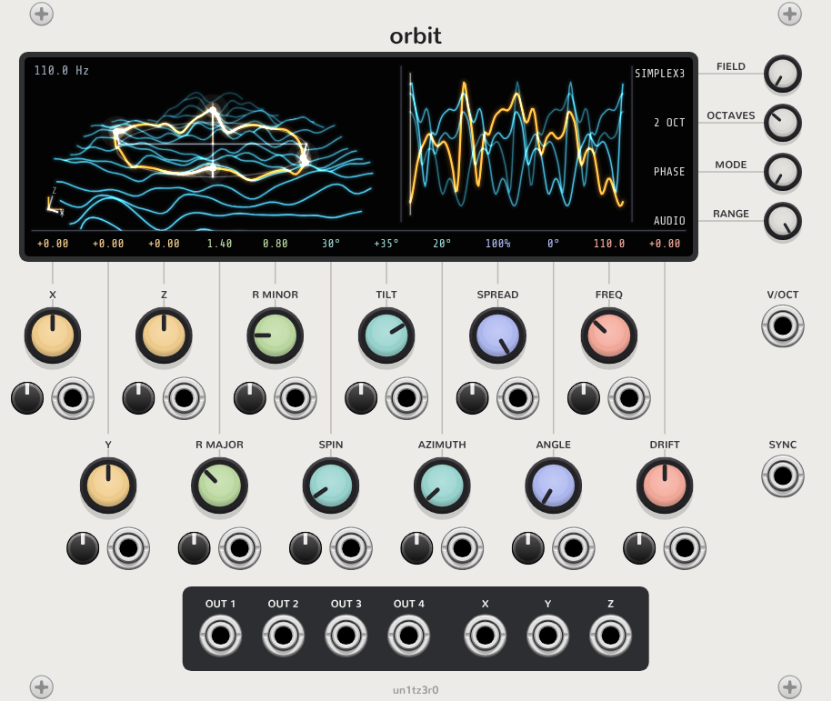
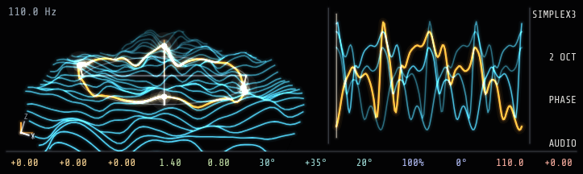

# Complex Oscillators for VCV Rack 2

Oscillators that read their waveforms off 3D fields by sweeping rings through them, each with an OLED-style 3D view of what it is doing.

## Orbit



Orbit sweeps an elliptical ring through a 3D field (OpenSimplex2 in 3D or 2D, or a gyroid, with up to 4 fractal octaves) and outputs what the ring reads.

- **Ring controls.** Center X/Y/Z, major and minor radius, and spin, tilt and azimuth each have a knob, an attenuverter and a CV input. A full ±5 V CV sweep covers the knob's whole range.
- **Drift.** Moves the ring through the field along Z over time, so the timbre keeps evolving.
- **Outputs 1–4.** In phase mode, all four outputs read one ring, each one `spread/4` of a cycle ahead of the last; ANGLE offsets them all together. In pinch mode, each output reads its own copy of the ring. The copies meet at ANGLE and fan apart by SPREAD on the opposite side.
- **X/Y/Z outputs.** The coordinates of output 1's sample point. Drift is left out so the voltages stay in range.
- **Range and polyphony.** RANGE switches between LFO and audio. The module is polyphonic across V/OCT and every CV input. SYNC is a hard reset of the phase.
- **Panel.** The twelve ring knobs sit in two rows, the second offset by half a step, each with its attenuverter and CV input beneath it. A wire runs from every knob up to the bottom of the screen, which shows that knob's value, CV included, where the wire arrives. The four selectors sit beside the screen and are wired to its right edge the same way. Panels follow Rack's dark-panel setting.
- **Context menu.** DC removal and level normalization are both on by default. They come from a survey of each ring taken every 256 samples. The menu also has a new noise seed and the display options, including its color: cyan, green, amber, violet or white.
- **Display.** The display shows the field slice as a relief, the ring lifted onto it (one cycle of the waveform wrapped around the ring), each output's probe with its stem height as its current value, world axes, and beside it an unrolled strip of the four waveforms. Drag it to orbit the camera. Audio-rate phase can't be drawn at frame rate, so above 2 Hz the probes turn at the pitch folded down by octaves to under 0.5 Hz.



## Layout

- `src/core/`: header-only and independent of Rack. OpenSimplex2 noise, fields, rings, the phasor, `OrbitShape` and `OrbitVoice` (the oscillator itself), a pinhole camera, the `Painter` drawing interface, `OrbitView` (a field's relief with rings lifted onto it) and `OrbitScene` (the whole display). `Panel` describes a front panel in millimetres and draws the plugin's knobs; `OrbitPanel` holds Orbit's ids, knob table and layout.
- `src/OledDisplay.*`: a Rack widget that paints a `Painter` scene with NanoVG on the light layer, so it glows when the room is dimmed.
- `src/PanelArt.*`: builds a module's widgets and paints its panel art from a `Panel`, following Rack's dark-panel setting.
- `src/Orbit.cpp`: the Orbit module and its display.
- `tools/render`: a headless renderer that uses the same core, view and panel code, so sounds and visuals can be checked without Rack.

## Building

```sh
make RACK_DIR=/path/to/Rack-SDK   # the plugin
make -C tools                     # the renderer
```

## Renderer

```sh
tools/render --out demo --orient 30,35,20 --radii 1.4,0.8 --outputs 3 --octaves 2
```

This writes `demo.wav` (32-bit float, one channel per output, about ±1), `demo-scope.svg` (two cycles) and `demo-view.svg`, which is the module's display drawn by the same code. With `--frames N` it writes `demo-view-0000.svg` and onward for animation. With `--panel light` or `--panel dark` it also writes `demo-panel.svg`, a mockup of the whole panel with its knobs set to the options. Pass `--rack` a Rack source or SDK folder to draw its jacks, trimpots and screws from its own artwork.

| Option | Default | Meaning |
|---|---|---|
| `--freq` `--seconds` `--rate` | 110, 2, 48000 | Audio pitch, length and sample rate |
| `--field` | simplex3 | `simplex2`, `simplex3` or `gyroid` |
| `--seed` `--octaves` | 0, 1 | Noise seed and fractal octaves |
| `--center x,y,z` | 0,0,0 | Ring center |
| `--radii major,minor` | 1,1 | Ellipse radii |
| `--orient spin,tilt,azimuth` | 0,0,0 | Ring orientation in degrees |
| `--drift` | 0 | Center travel along Z, in units per second |
| `--mode` | phase | `phase` spreads outputs around one ring; `pinch` makes rings that meet at `--angle` |
| `--outputs` `--spread` `--angle` | 1, 0.5, 0 | Output count, spread (phase offsets or pinch fan-out) and angle (phase offset or meeting point, degrees) |
| `--remove-dc` `--normalize` | 1, 1 | Center and normalize each output as the module does |
| `--frames` `--fps` `--size w,h` | 1, 30, 723,216 | View frames to write, and their size (default is twice the module display) |
| `--cam az,el` `--cam-orbit` | -60,29, 0 | Camera angles in degrees relative to the ring's plane, and orbit speed in degrees per second |
| `--view-rate` | 0.25 | Probe speed in the view frames, in cycles per second |
| `--accent` | 0 | Display color: 0 cyan, 1 green, 2 amber, 3 violet, 4 white |
| `--panel` `--rack` `--panel-scale` | none, none, 6 | Panel mockup (`light` or `dark`), Rack folder for component art, and pixels per millimetre |
